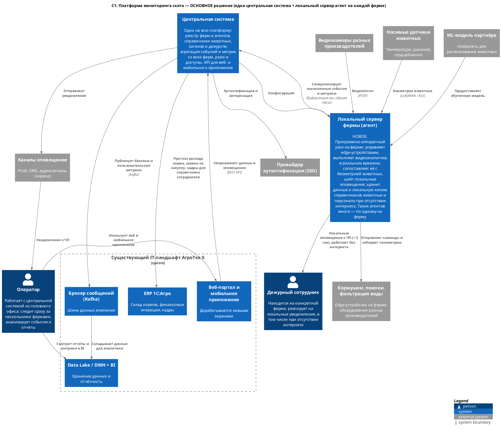
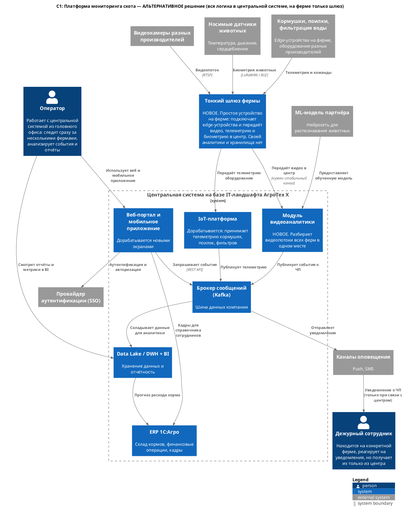

### **Название задачи:**
MVP платформы мониторинга скота для «АгроТех Х» (ADR-001, уровень контекста C4 — C1)

### **Автор:**
Сергей Корогод

### **Дата:**
2026-09-01

### **Функциональные требования**

|**№**|**Действующие лица или системы**|**Описание**|
| :-: | :- | :- |
|1|Агент фермы, оператор, дежурный|Фиксировать беспокойное поведение и драки животных, оповещать о них|
|2|Агент фермы, оператор, дежурный|Фиксировать признаки задавливания поросят|
|3|Агент фермы, кормушки и поилки|Управлять кормушками и поилками разных производителей|
|4|Агент фермы, оператор|Оценивать состояние животных по виду и поведению: болезнь, гибель, беспокойство|
|5|Агент фермы, системы фильтрации воды|Следить за состоянием систем фильтрации воды|
|6|Агент фермы, оператор|Пересчитывать поголовье|
|7|Центральная система, ERP 1С:Агро|Следить за запасами корма и прогнозировать расход|
|8|Агент фермы, видеокамеры|Поддерживать нужное количество камер разных производителей для аналитики в реальном времени|
|9|Центральная система, агенты ферм|Работать по схеме «центральная система — агенты» без ограничения числа агентов, синхронизация с задержкой до 10 минут|
|10|Центральная система, внешние системы|Предоставлять базовые метрики для передачи в другие системы|
|11|Центральная система, оператор|Позволять добавлять собственные метрики|
|12|Агент фермы, дежурный, центральная система|Работать без интернета, оповещать дежурного на месте, после восстановления связи синхронизироваться с центром|
|13|Оператор, дежурный, провайдер SSO|Разделять роли, поддерживать современную аутентификацию и авторизацию|
|14|Центральная система, веб- и мобильное приложение|Предоставлять API для веб- и мобильного приложения|
|15|Агент фермы, носимые датчики животных|Собирать биометрию животных (температура, дыхание, сердцебиение) и учитывать её при оценке состояния|
|16|Центральная система, ERP 1С:Агро, агент фермы|Вести справочники животных, загонов и дежурств, брать кадры из ERP, держать на ферме локальную копию|

### **Нефункциональные требования**

|**№**|**Требование**|
| :-: | :- |
|1|Отказоустойчивость 99,95%|
|2|Расширяемость: новый функционал добавляется без изменения существующего|
|3|От возникновения ЧП до оповещения — не более 5 секунд|
|4|Видеоаналитика работает в реальном времени (миллисекунды)|
|5|Нестабильный WiFi на фермах, нужны альтернативные каналы связи|
|6|На ферме допустим один локальный сервер и набор edge-устройств|
|7|Камеры должны снимать ночью, обученную модель предоставляет партнёр|
|8|Задержка синхронизации фермы с центром — до 10 минут|
|9|Носимые датчики работают на батарее и передают данные по маломощному радиоканалу с интервалом в минуты|

### **Решение**

Термины:

- **Центральная система** — одна на всю платформу, размещается в головном офисе или облаке. Ведёт реестр ферм, собирает события и метрики, управляет ролями и доступами, предоставляет API.
- **Агент** — локальный сервер фермы вместе с его ПО. Управляет edge-устройствами: камерами, носимыми датчиками животных, кормушками, поилками, фильтрами. Количество агентов равно количеству ферм.

Пользователей два: **оператор** работает с центральной системой и наблюдает за несколькими фермами, **дежурный сотрудник** находится на конкретной ферме и реагирует на локальные уведомления.

Выбрано решение **«локальный сервер-агент на ферме + одна центральная система»**. Видеоаналитика, обработка данных носимых датчиков, оповещения и хранение данных выполняются на ферме. Центральная система собирает события и метрики со всех ферм и предоставляет API.

Диаграмма контекста: [c1-main.puml](c1-main.puml)

Обоснование:

- НФТ 3 и 4 (5 секунд до оповещения, обработка видео в реальном времени) и ФТ 12 (работа без интернета) выполняются только при обработке видео на ферме. При передаче видео в центр время реакции зависит от канала связи, а канал нестабилен (НФТ 5).
- В центр передаются события и метрики, а не видео. Объём трафика при этом невелик, а допустимая задержка синхронизации составляет 10 минут (НФТ 8).
- ФТ 9 выполняется за счёт одинаковых агентов: подключение новой фермы не требует изменений в центральной системе (НФТ 2).
- Недоступность одной фермы не влияет на остальные фермы и на центральную систему (НФТ 1).
- Оборудование разных производителей (ФТ 3, 8, 15) подключается через слой адаптеров в составе агента.
- Используются два источника данных: видео и биометрия с носимых датчиков (ФТ 15). Рост температуры, изменение дыхания и сердечного ритма по видео не определяются. Оба потока обрабатывает агент фермы, поэтому оценка состояния животных не зависит от связи с центром.
- Существующие системы переиспользуются: Kafka — шина метрик, Data Lake / DWH + BI — отчётность, ERP 1С:Агро — склад кормов (ФТ 7, 10), веб-портал и мобильное приложение — клиенты API (ФТ 14), внешний SSO — роли и аутентификация (ФТ 13).

### **Альтернативы**

**Вся логика в центральной системе.** На ферме размещается тонкий шлюз, видео передаётся в центр. Обработку выполняет общий модуль видеоаналитики, телеметрия поступает в IoT-платформу, уведомления рассылаются из центра.

Диаграмма контекста: [c1-alternative.puml](c1-alternative.puml)

Преимущества: меньше стоимость и срок разработки, переиспользуется больше существующих систем, обновления выполняются в одном месте, на ферме требуется недорогое оборудование.

Причины отказа:

- При отсутствии связи обработка данных фермы не выполняется, ФТ 12 не выполняется.
- Передача видео со 150+ площадок по нестабильному каналу не позволяет гарантировать НФТ 3 и 4.
- С ростом числа ферм увеличиваются расходы на каналы связи и нагрузка на центральную систему.
- При переходе к SaaS фермы сторонних компаний потребуется подключать к внутреннему контуру.

**Недостатки, ограничения, риски**

- Стоимость оборудования: на каждой ферме требуется сервер с GPU.
- Эксплуатация: обновления кода и ML-модели необходимо доставлять на все фермы.
- Срок разработки MVP выше: разрабатываются и агент, и центральная система.
- Данные в центральной системе отстают от данных фермы до 10 минут, при отсутствии связи — дольше. Источником данных по событиям считается агент фермы.
- Объём MVP ограничен сценариями: драки, задавливание поросят, пересчёт поголовья, контроль кормушек и поилок. Прогноз расхода корма и пользовательские метрики переносятся на следующую итерацию.
- Точность модели ограничена: тени, схожесть особей и ночная съёмка дают ошибки распознавания. Для MVP допускаются ложные срабатывания, пропуск события считается недопустимым.
- Датчики передают данные с интервалом в минуты (НФТ 9), поэтому в 5 секунд (НФТ 3) укладывается только видеоаналитика. Биометрия используется как дополнительный признак и для подтверждения состояния животного.
- Датчики работают на батарее и требуют обслуживания.
- Применение датчиков требует проверки ветеринарных и законодательных ограничений.
- Кадры берутся из ERP 1С:Агро, поэтому появляется зависимость от её доступности. На ферме работает копия справочника, она может отставать от кадровых изменений.
- Персональные данные сотрудников хранятся не только в центре, но и на каждой ферме. Требуются правила доступа и удаления.
- Логика животноводства не размещается в ERP и SCADA, так как это ограничит расширяемость (НФТ 2) и последующий вынос платформы в SaaS. Из ERP берутся только кадровые данные.

