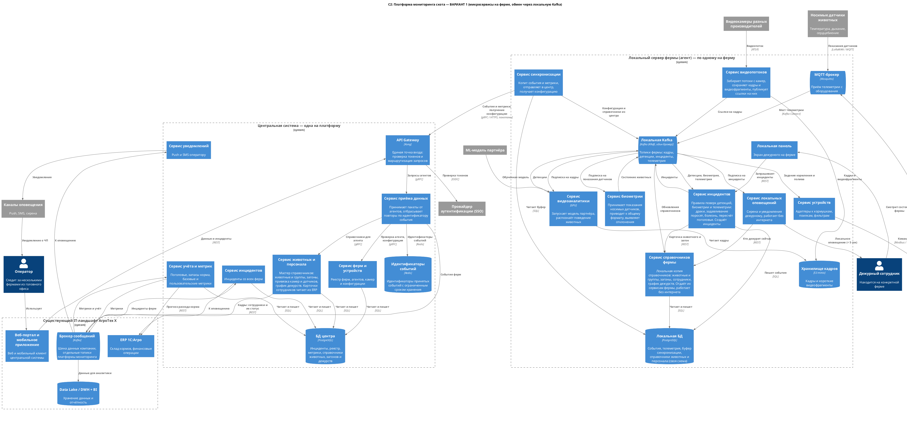
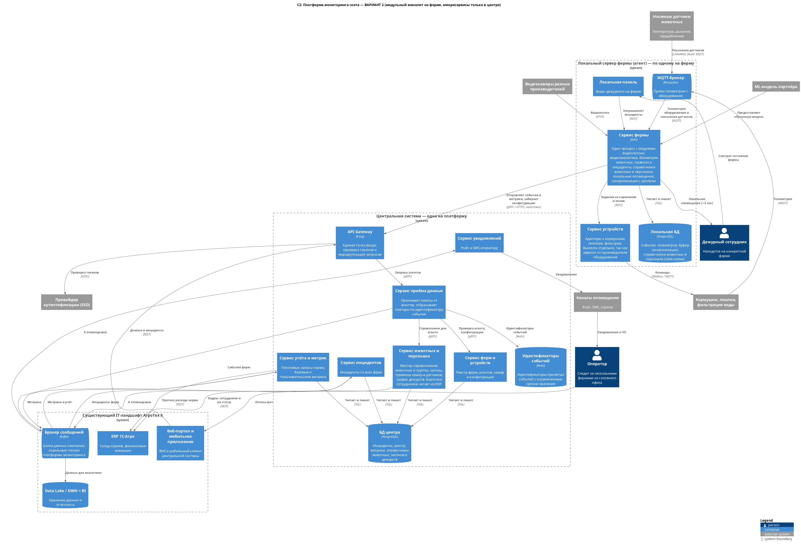

### **Название задачи:**
Ограниченные контексты и состав сервисов платформы мониторинга скота (ADR-002, уровень контейнеров C4 — C2)

### **Автор:**
Сергей Корогод

### **Дата:**
2026-09-06

### **Функциональные требования**

Полный список — в [ADR-001](../Task1/ADR-001-monitoring-livestock.md). Здесь только то, что определяет состав сервисов.

|**№**|**Действующие лица или системы**|**Описание**|
| :-: | :- | :- |
|1|Камеры, агент фермы|Распознавать поведение животных: драки, задавливание поросят, болезнь, гибель, пересчёт поголовья|
|2|Носимые датчики, агент фермы|Собирать биометрию животных и выявлять отклонения|
|3|Агент фермы, дежурный|Создавать инциденты по видео и биометрии, оповещать дежурного на месте|
|4|Агент фермы, кормушки, поилки, фильтры|Управлять оборудованием разных производителей и собирать телеметрию|
|5|Центральная система, ERP 1С:Агро|Вести учёт поголовья и запасов корма, прогнозировать расход|
|6|Центральная система, агенты ферм|Вести реестр ферм и устройств, раздавать конфигурацию|
|7|Центральная система, внешние системы|Предоставлять базовые и пользовательские метрики|
|8|Оператор, дежурный, SSO|Разделять роли, поддерживать аутентификацию и авторизацию|
|9|Оператор, центральная система, ERP 1С:Агро, агент фермы|Вести справочники животных, загонов и дежурств, брать кадры из ERP, держать на ферме локальную копию|

### **Нефункциональные требования**

|**№**|**Требование**|
| :-: | :- |
|1|От ЧП до оповещения — не более 5 секунд, обработка видео в реальном времени|
|2|Работа фермы без интернета, синхронизация с центром с задержкой до 10 минут|
|3|Отказоустойчивость 99,95%|
|4|Расширяемость: новый функционал добавляется без изменения существующего|
|5|На ферме один локальный сервер, канал связи до центра нестабильный|

### **Ограниченные контексты**

|**Контекст**|**Ответственность**|**Где работает**|
| :- | :- | :- |
|Видеонаблюдение и аналитика|Приём потоков с камер, запуск модели партнёра, выдача детекций|Ферма|
|Биометрия животных|Приём показаний датчиков, выявление отклонений|Ферма|
|Инциденты и оповещения|Правила поверх детекций, биометрии и телеметрии, уведомления|Ферма и центр|
|Оборудование фермы|Адаптеры к кормушкам, поилкам, фильтрам|Ферма|
|Животные и персонал|Животные и группы, загоны, привязка камер и датчиков, график дежурств. Кадры читаются из ERP|Центр — мастер, ферма — копия|
|Учёт и метрики|Поголовье, запасы корма, базовые и пользовательские метрики|Центр|
|Реестр ферм и устройств|Список ферм, агентов, камер, конфигурация|Центр|
|Синхронизация|Буфер данных фермы и обмен с центром|Ферма и центр|
|Доступ и роли|Аутентификация, авторизация, роли|Внешний SSO|

Границы проведены по месту обработки данных: видео, биометрия и оборудование — только на ферме (НФТ 1, 2), учёт и реестр — только в центре, где есть данные всех ферм. Биометрия отделена от видео: другой источник и темп поступления (минуты против миллисекунд). Инциденты есть в обоих местах: на ферме создаются, в центре хранятся и показываются оператору.

### **Решение**

Вариант 1: на ферме несколько небольших сервисов, обмен между ними через локальную Kafka по схеме публикация-подписка. В центре микросервисы за API Gateway.

Диаграмма контейнеров: [c2-main.puml](c2-main.puml)

Обоснование:

- Каждый контекст — отдельный сервис, новый сценарий добавляется без изменения существующих (НФТ 4).
- Видеоаналитика отделена: требует GPU и обновляется вместе с моделью партнёра.
- Обмен через Kafka: сервисы не зависят от доступности соседа, сообщения ждут в топике (НФТ 3).
- Локальная БД и сервис синхронизации дают работу без интернета (НФТ 2).

Интеграции:

|**Что связываем**|**Технология**|**Почему**|**Ограничение**|
| :- | :- | :- | :- |
|Оборудование и датчики с агентом|MQTT (Mosquitto), датчики по LoRaWAN, мост в Kafka|Стандарт для устройств и батарейных датчиков, данные попадают в общие топики|Оборудование без MQTT — через адаптер Modbus. Показания датчиков идут с интервалом в минуты|
|Сервисы внутри агента|Kafka, публикация-подписка|Технология уже есть в компании, сообщения переживают перезапуск сервиса|Требовательна к памяти и диску, на ферме один брокер без резервирования|
|Видеопотоки и видеоаналитика|Kafka со ссылкой на кадр, кадр в локальном хранилище|Через брокер идут только ссылки, аналитику можно перезапускать|Хранилище нужно чистить по расписанию|
|Агент и центр|gRPC поверх HTTPS через Kong, пакетами|Экономит трафик, переживает обрывы, повтор по идентификатору события|Данные в центре отстают до 10 минут|
|Центр и агент|Агент сам забирает конфигурацию|Фермы за NAT, входящие соединения недоступны|Конфигурация применяется с задержкой|
|Вход в центр|API Gateway Kong|Одна точка входа для агентов и портала: токены и маршрутизация|Единая точка отказа, нужно резервирование|
|Повторы от агентов|Redis, идентификаторы событий с ограниченным сроком хранения|Нужна только проверка «событие уже принято»|Данные в памяти, при перезапуске часть ключей теряется|
|Сервисы центра между собой|Корпоративная Kafka, отдельные топики|Сглаживает всплеск, когда агенты выгружают накопленное; новый потребитель подписывается без правок в источнике (НФТ 4)|Обработка асинхронная, недоступность Kafka останавливает разбор данных ферм|
|Передача данных в компанию|Те же топики Kafka, далее DWH|Отчётность получает данные из существующей шины (ФТ 7)|Формат сообщений общий с другими потребителями, изменения нужно согласовывать|
|Кадры|REST к ERP 1С:Агро, карточки сотрудников кэшируются в центре|Сотрудники уже ведутся в 1С, увольнение и отпуск не нужно синхронизировать отдельно|Зависимость от доступности 1С. На ферме работает копия, она может отставать от кадровых изменений|
|Справочники на ферму|Тот же канал, что и конфигурация правил: агент забирает через Kong и публикует в локальный топик|Один механизм доставки вместо двух|Копия отстаёт от центра; сотрудник, заведённый при отсутствии связи, не сможет войти на ферме до её восстановления|
|Аутентификация|Внешний SSO по OIDC|Своё решение не разрабатывается (ФТ 8)|При недоступности SSO вход в центр невозможен, на ферме нужна локальная учётная запись|

### **Альтернативы**

Вариант 2: на ферме один сервис с модулями (видеопотоки, аналитика, биометрия, правила, оповещения, синхронизация), отдельно вынесен только сервис устройств. Центр тот же.

Диаграмма контейнеров: [c2-alternative.puml](c2-alternative.puml)

Преимущества: меньше разработки и короче срок MVP, ниже требования к серверу фермы (Kafka не нужна), проще развёртывание.

Причины отказа:

- Обновление любого модуля требует перезапуска всего сервиса, включая видеоаналитику.
- Расширение функционала затрагивает общий код (НФТ 4), а ошибка в одном модуле останавливает остальные (НФТ 3).

Вариант 2 остаётся запасным для первых пилотных ферм, если потребуется сократить срок MVP.

**Недостатки, ограничения, риски**

- Девять сервисов на ферме: выше требования к серверу и сложнее обновление.
- Kafka на ферме в одном экземпляре, резервирование на одном сервере невозможно (НФТ 5). Нужно заложить память, диск и срок хранения топиков.
- Логика инцидентов есть и на ферме, и в центре — правила нужно поддерживать согласованными.
- Kafka доставляет сообщения не менее одного раза, поэтому на ферме нужны две проверки: дедупликация событий по идентификатору и подавление повторов инцидентов по типу и загону. Идентификаторы обработанных событий хранятся ограниченное время.
- Данные хранятся в двух местах с расхождением до 10 минут. Источник данных по событиям — агент фермы, по справочникам — центральная система.
- Справочники на ферме лежат в той же локальной БД, что и события, но в своей схеме и со своими репозиториями. Отдельная БД на одном сервере фермы даёт только второй процесс в эксплуатацию; разделять при выносе платформы в SaaS.
- Персональные данные сотрудников хранятся на каждой ферме. Требуются правила доступа и удаления.
- Оповещения идут двумя путями (локально и из центра), возможны повторные уведомления по одному инциденту.
- Через сервис приёма проходит весь поток от ферм, его нужно масштабировать вместе с числом агентов. Срок хранения ключей в Redis должен превышать максимальное время накопления данных на ферме.
- Центр зависит от корпоративной Kafka: при её недоступности события ферм не доходят до сервисов, агенты повторяют отправку.
- Биометрия и видео поступают с разной частотой, правила их сопоставления требуют проверки на пилоте. Датчики работают на батарее, нужен учёт замены.
- Задержку на публикацию и чтение сообщений нужно подтвердить нагрузочным тестом на ферме с максимальным числом камер (НФТ 1).
- Объём MVP ограничен ФТ 1, 2 и 4. Прогноз расхода корма и пользовательские метрики — следующей итерацией.
