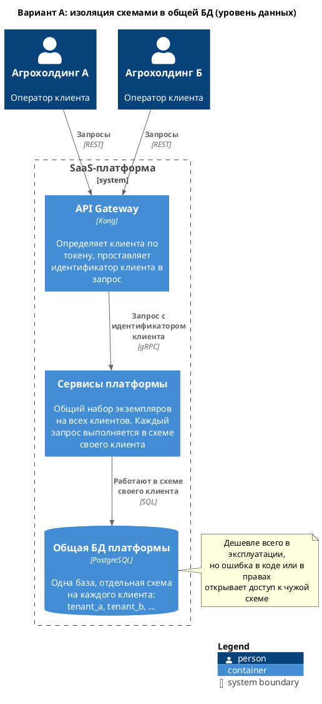
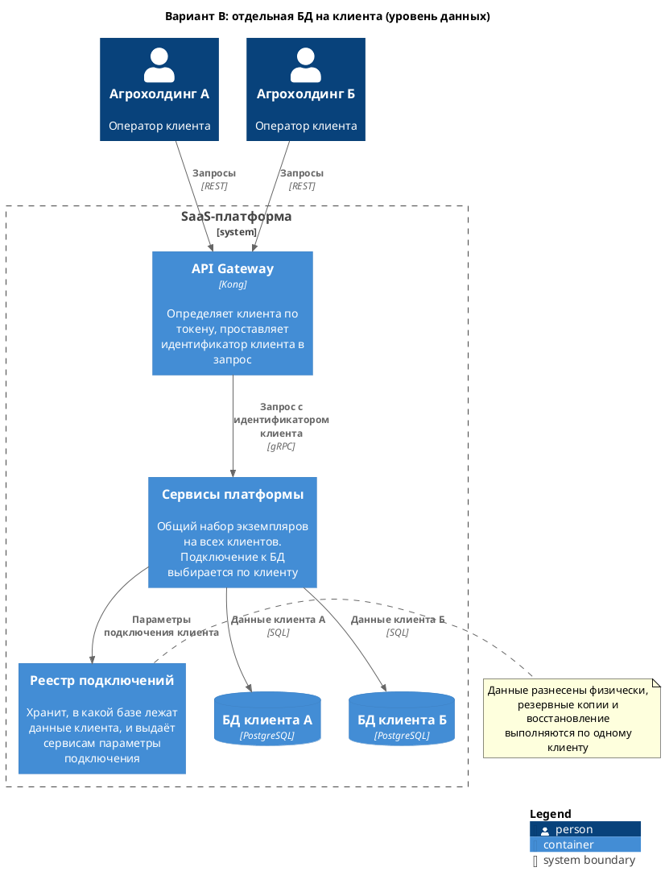
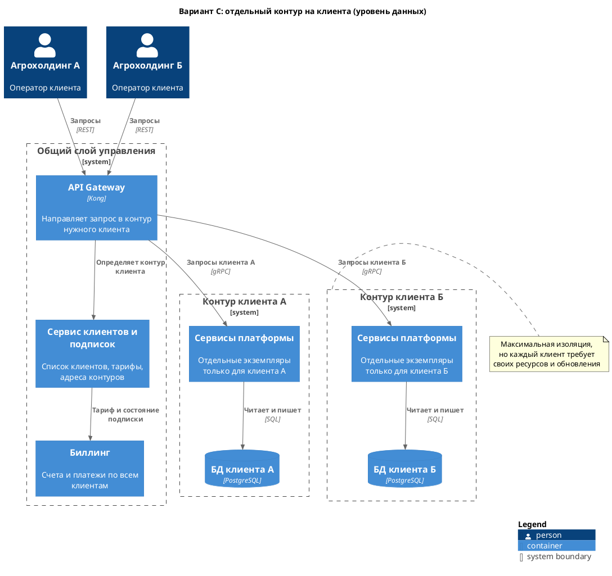
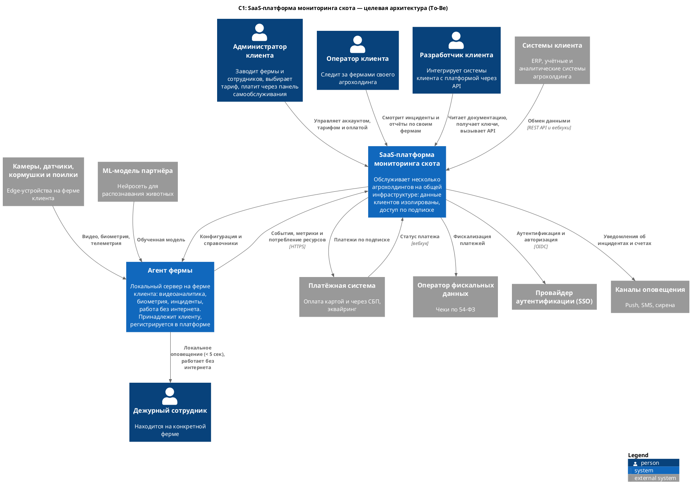
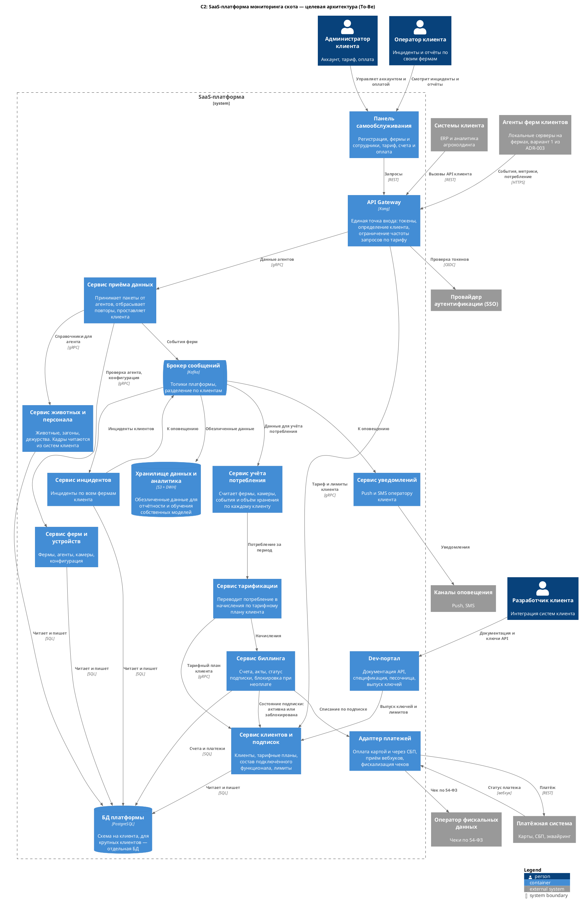
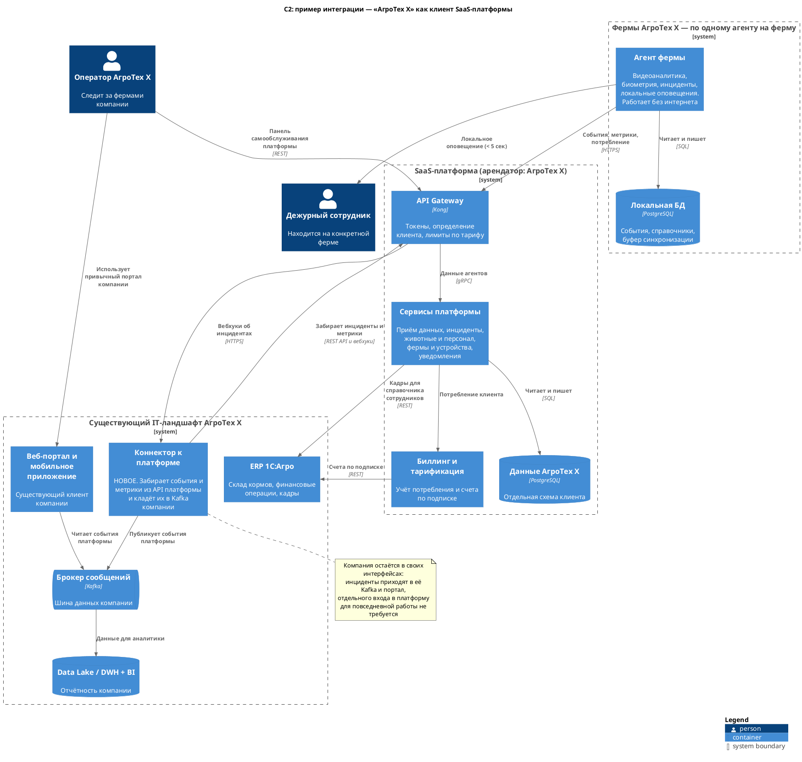

### **Название задачи:**
Развитие MVP в мультитенантную SaaS-платформу: изоляция данных, платежи, API для клиентов (ADR-004)

### **Автор:**
Сергей Корогод

### **Дата:**
2026-09-07

### **Основание**

За основу берём вариант 1, выбранный в [ADR-003](../Task4/ADR-003-variant-comparison.md): на ферме несколько сервисов с обменом через локальную Kafka, в центре набор микросервисов. Агенты взаимодействую с центром через API Gateway, расположенный на стороне центра. Агент фермы при переходе в SaaS не меняется. Меняется центральная часть: у неё появляются несколько клиентов, подписки и оплата.

Требования и состав сервисов MVP — в [ADR-001](../Task1/ADR-001-monitoring-livestock.md) и [ADR-002](../Task2/ADR-002-bounded-contexts.md).

### **Функциональные требования**

|**№**|**Действующие лица или системы**|**Описание**|
| :-: | :- | :- |
|1|Платформа, клиенты|Полностью изолировать данные разных клиентов|
|2|Администратор клиента, платформа|Поддерживать тарифные планы и подписки с возможностью выбора функционала|
|3|Разработчик клиента, системы клиента|Предоставлять API для интеграции с системами клиента|
|4|Администратор клиента|Панель самообслуживания: аккаунт, фермы, сотрудники, тариф, оплата. Отдельного интерфейса администратора платформы пока нет|
|5|Платформа|Собирать метрики использования для аналитики и биллинга|
|6|Платформа, платёжная система, ОФД|Принимать оплату через российские платёжные системы и выдавать фискальные чеки|
|7|Разработчик клиента|Документация и песочница для самостоятельной интеграции|

### **Нефункциональные требования**

|**№**|**Требование**|
| :-: | :- |
|1|Горизонтальное масштабирование по мере роста числа клиентов|
|2|Данные одного клиента недоступны другому|
|3|Требования MVP: оповещение за 5 секунд, работа фермы без интернета|
|4|Учёт потребления пригоден для выставления счетов: расхождение с фактом недопустимо|

---

## Задача 1. Мультитенантная архитектура и изоляция данных

### **Критерии сравнения вариантов изоляции**

Вес: 3 — критично, 2 — важно, 1 — желательно.

|**№**|**Критерий**|**Что проверяем**|**Вес**|
| :-: | :- | :- | :-: |
|К1|Надёжность изоляции|Что должно отказать, чтобы клиент увидел чужие данные|3|
|К2|Стоимость инфраструктуры на клиента|Сколько ресурсов добавляет каждый новый клиент|3|
|К3|Скорость подключения клиента|Сколько занимает создание нового арендатора|2|
|К4|Эксплуатация|Обновления, резервные копии, восстановление|2|
|К5|Индивидуальные требования|Возможность выделить клиенту свой контур по требованиям безопасности|1|

### **Вариант A. Изоляция схемами в общей БД**

Одна база, отдельная схема на каждого клиента. Сервисы общие, клиент определяется по токену.

Диаграмма: [isolation-schema.puml](isolation-schema.puml)

### **Вариант B. Отдельная БД на клиента**

Сервисы общие, у каждого клиента своя база. Реестр подключений хранит, где лежат данные клиента.

Диаграмма: [isolation-database.puml](isolation-database.puml)

### **Вариант C. Отдельный контур на клиента**

У каждого клиента свои экземпляры сервисов и своя база. Общими остаются шлюз, сервис клиентов и биллинг.

Диаграмма: [isolation-instance.puml](isolation-instance.puml)

### **Анализ**

Оценка: 3 — хорошо, 2 — приемлемо, 1 — слабо.

|**Критерий**|**A: схемы**|**B: отдельные БД**|**C: контуры**|**A**|**B**|**C**|
| :- | :- | :- | :- | :-: | :-: | :-: |
|К1 Надёжность изоляции|Достаточно ошибки в коде или в правах|Нужна ошибка в выборе подключения|Контуры разделены на уровне развёртывания|1|2|3|
|К2 Стоимость на клиента|Клиент добавляет только схему|Каждая база требует своих ресурсов|Полный набор сервисов на клиента|3|2|1|
|К3 Скорость подключения|Создание схемы, минуты|Создание базы и настройка доступа|Развёртывание контура|3|2|1|
|К4 Эксплуатация|Одно обновление на всех|Обновление одно, копий много|Обновление в каждом контуре|3|2|1|
|К5 Индивидуальные требования|Не выполняется|Частично: данные отдельно|Выполняется полностью|1|2|3|
|**Итого с учётом веса**| | | |**23**|**20**|**17**|

### **Решение**

Выбирается **вариант A как основной, с возможностью перевести отдельного клиента на вариант B или C**.

Обоснование:

- Бизнес-цель — регулярный доход и быстрое подключение клиентов. Вариант A даёт минимальную стоимость на клиента и подключение за минуты (К2, К3).
- Слабое место варианта A — надёжность изоляции (К1). Оно закрывается техническими мерами, а не выбором хранилища: клиент определяется в API Gateway и передаётся дальше как часть контекста запроса, запросы выполняются под учётной записью схемы клиента, доступ к чужой схеме на уровне прав запрещён.
- Крупному клиенту с требованиями по безопасности выделяется своя база (вариант B) или свой контур (вариант C) на более дорогом тарифе. Код сервисов при этом не меняется — меняется только выбор подключения.

---

## Задача 2. Биллинг и монетизация

Добавляются четыре сервиса:

|**Сервис**|**Ответственность**|
| :- | :- |
|Сервис учёта потребления|Считает по каждому клиенту: число ферм и камер, объём событий, объём хранения видеофрагментов|
|Сервис тарификации|Переводит потребление в начисления по тарифному плану клиента|
|Сервис биллинга|Счета, акты, статус подписки, блокировка доступа при неоплате|
|Адаптер платежей|Оплата картой и через СБП, приём вебхуков о статусе, фискализация чеков|

Тарификация строится на потреблении, а не на числе пользователей: клиент платит за фермы и камеры, потому что именно они создают нагрузку.

**Интеграция с платёжными системами.** Платежи проходят через российского провайдера: оплата картой и через СБП для небольших клиентов, безналичный счёт для крупных агрохолдингов. Чек по 54-ФЗ выдаёт оператор фискальных данных. Решения:

- Все внешние вызовы платежей идут через один адаптер, платформа не зависит от конкретного провайдера. Смена провайдера — замена адаптера.
- Результат платежа приходит вебхуком, поэтому у платежа есть идентификатор и повторный вебхук не создаёт второй платёж.
- Блокировка при неоплате отключает доступ к панели и API, но не останавливает агентов на фермах: оповещение дежурного о ЧП продолжает работать. Пропуск ЧП из-за неоплаты недопустим.

---

## Задача 3. Интеграции с клиентами

**Состав API.** Клиенту доступно только то, что относится к его данным:

|**Раздел**|**Что доступно**|
| :- | :- |
|Инциденты|Чтение списка и карточки, подписка на вебхуки|
|Фермы и устройства|Чтение и изменение состава ферм, камер и датчиков|
|Животные и персонал|Чтение и изменение справочников, загрузка данных из систем клиента|
|Метрики|Чтение базовых и пользовательских метрик за период|
|Аккаунт|Тариф, потребление, счета|

Недоступно: данные других клиентов, внутренние настройки платформы, прямой доступ к видеопотокам и кадрам ферм.

**Как устроен доступ.** Ключ выпускается в dev-портале и привязан к клиенту, состав разделов определяется тарифом, ограничение частоты запросов настраивается в API Gateway. Быстрые события клиент получает вебхуками, историю — запросами.

**Документация.** Dev-портал содержит спецификацию API, примеры, песочницу с тестовым клиентом и выпуск ключей. Это же требование онбординга: клиент должен подключиться самостоятельно, без участия команды платформы.

---

## Задача 4. Целевая архитектура To-Be

### **Контекст (C1)**

Диаграмма: [c1-saas.puml](c1-saas.puml)

### **Контейнеры (C2)**

Диаграмма: [c2-saas.puml](c2-saas.puml)

### **Пример интеграции: «АгроТех Х» как клиент**

Компания, для которой строился MVP, становится обычным арендатором платформы. Её фермы подключаются типовыми агентами, а существующий ландшафт получает данные через API: коннектор забирает инциденты и метрики и публикует их в корпоративную Kafka, откуда они попадают в привычные портал и DWH. Кадры для справочника сотрудников платформа по-прежнему читает из 1С:Агро.

Диаграмма: [c2-integration-agrotech.puml](c2-integration-agrotech.puml)

---

**Недостатки, ограничения, риски**

- Изоляция схемами держится на корректности кода и настройке прав. Требуются автоматические проверки: ни один запрос не выполняется без идентификатора клиента, тесты на попытку доступа к чужой схеме.
- Общие сервисы означают общую нагрузку: активность одного клиента влияет на других. Нужны лимиты по тарифу в API Gateway и отдельные очереди для крупных клиентов.
- Учёт потребления становится основанием для счёта. Ошибка в подсчёте — это спор с клиентом, поэтому данные потребления хранятся неизменяемыми и сверяются с событиями.
- Сбор обезличенных данных для обучения собственных моделей конфликтует с требованием изоляции. Использовать данные клиента можно только по условиям договора, обезличивание должно исключать привязку к конкретной ферме.
- Отдельного интерфейса администратора платформы пока нет: подключение клиента и разбор проблем выполняются вручную. При росте числа клиентов это станет узким местом.
- Переход «АгроТех Х» из владельца системы в арендатора требует миграции данных ферм в схему клиента и согласования, какие данные компании доступны платформе.
